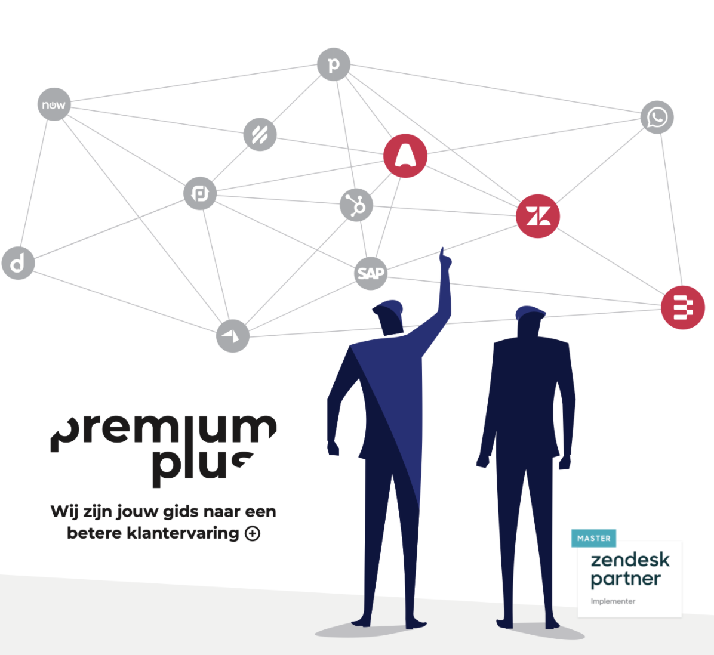

# Zendesk App Developer - Vacature

Premium Plus is looking for an extra developer to join our development team.

We are a Zendesk Master Partner specialised in integrating external platforms into Zendesk and making external data available to agents in Zendesk.

# What we do
## Zendesk Sidebar Apps
We build integrations for existing systems our customers use for Zendesk. These are almost always sidebar apps in Zendesk Support or Sell that link back via API to external sources.

- Get data from external API sources (CSV, HTTP API, SOAP,..)
- Show data in an HTML frame powered by Javascript/JQuery
- Allow agents to push data back to the external system

## Data migrations
Our customers often come from existing platforms where they host tickets, FAQ content or scripts. 

- Get data from existing platforms or CSV files
- Convert them to data compatible with Zendesk
- Import into Zendesk using the Zendesk API
- E.g. import tickets, users, Help Center articles

## Automations
Although Zendesk has an extensive [marketplace](https://zendesk.com/marketplace), some integrations require a custom script to run regularly to get data and reports to and from Zendesk.
We also invest heavily in automation deployments of our 'best practices' to new customer environments by leveraging the Zendesk API.

- Purpose built web applications that automate parts of our workflow
- Deploy best practice setups to client environments
- Create and restore configuration backups from client environments

## State of the art
Being a Master Integration Partner gives us access to a lot of EAP for the Zendesk Suite. We try go get the new features and API integrated into our offerings when they go live for all customers.

- Build proof of concept use cases for new Zendesk technologies
- Build missing Zendesk functionality via Zendesk (Marketplace) Apps

# What we often build
Below is a typical setup as requested by our clients.

## Basic requirements
- Their data lives in a database accessible via API
- They want to be able to search or filter that data
- Based on our search or filter we get a list of matches
- We retrieve one of those matches and show the contents of the object in a sidebar app.

## Zendesk specifics
- Matched objects can often be prefiltered based on metadata in the ticket (email, organization, name, custom field value,..)
- Once a match is selected we store a reference in a linked ticket field so the ticket will retrieve the value automatically the next time
- Design of the app makes uses of the [Zendesk Garden framework](https://garden.zendesk.com)

# How we work
Our development team is currently two developers and two external teams. We work autonomously on projects from concept to delivered product. Before going live the other team members review the app or integration and can give feedback or create issues.

We work mostly remote with online status meetings, and meet on a regular basis in our offices in Antwerp (if COVID restrictions allow) to catch up and discuss projects.

We develop as part of an existing customer project that contains Zendesk configuration, Help Center themes, custom sidebar apps, data migrations and integrations with existing platforms.
All development for customer tools starts and stops during the project and changes are made by request of a customer in a new project.

# Premium Plus
Need help managing customer expectations? At Premium Plus, we’re eager to help our customers make a difference, guiding them with an easy-to-use cloud solution for customer service that perfectly fits their brand’s style and voice.

From Aircall to Zendesk, we provide sales and support teams with the right processes, tools, set-up, and insights to deliver the top-notch service and unified customer experience that people have come to expect from their favourite brands. Anytime, anywhere. 

Premium Plus is a fast-growing and award-winning Zendesk partner with over 500 happy clients across Europe and offices in Benelux, France, and the UK. We are the plus in your customer experience.

# What can we offer you?
- Be part of a dynamic young team in a fast growing company
- You can work with and for big brands in Europe and make an actual impact on the way they offer customer care
- What we develop is shared across Zendesk and visible for their customers via the Zendesk Marketplace
- Working from one of our offices, at home or with clients 
- Attractive salary conditions

# What we’re looking for
We’re looking for a dynamic developer who can work across a broad range of projects. You’ll need to be able to work independently and take a project from concept to finished.

The usual suspects of team player, flexible, fast, efficient are a part of the job ;-)

You become a Premium Plus’er from A to Z, helping any customer or employee with a lot of drive.
You participate in projects to make Premium Plus even more fun and better and give second line support to our FLOH team (First Line Of Help) in answering and resolving support questions that come in from our customers or suppliers.

## Requirements
- HTML
- CSS
- Javascript
- JQuery
- HTTP POST/GET

## Nice to know:
- [Zendesk Platform, Zendesk API and Zendesk Custom Objects](https://developer.zendesk.com)
- [Cloudflare and Cloudflare Workers](https://workers.cloudflare.com/)
- [Git and GitHub Actions](https://github.com/features/actions)
- Tailwind CSS, SASS
- ReactJS, Node.js, ES6 Javascript
- [Zendesk Garden design platform](https://garden.zendesk.com)

We work within the macOS environment and you get an iPhone and MacBook Pro to work on.

# How to apply
Use the widget below or send an email to [thomasverschoren@premiumplus.io](mailto:thomasverschoren@premiumplus.io) with a short motivation and a link to some example projects.

These example projects should be within the technical scope we’re looking for and preferably a Github repo. 
These can be real projects, demo apps you made to test something out, or an app based on our example app scope provided in #2 above.

## Contact info
Premium Plus

- [+ 32 3 303 44 90](tel:+3233034490)
- [support@premiumplus.io](mailto:support@premiumplus.io)
- [premiumplus.io](https://premiumplus.io) - [APPS by premiumplus](https://premiumplus.app)

Offices : Antwerp - Lille - London	

<!-- scripts -->

